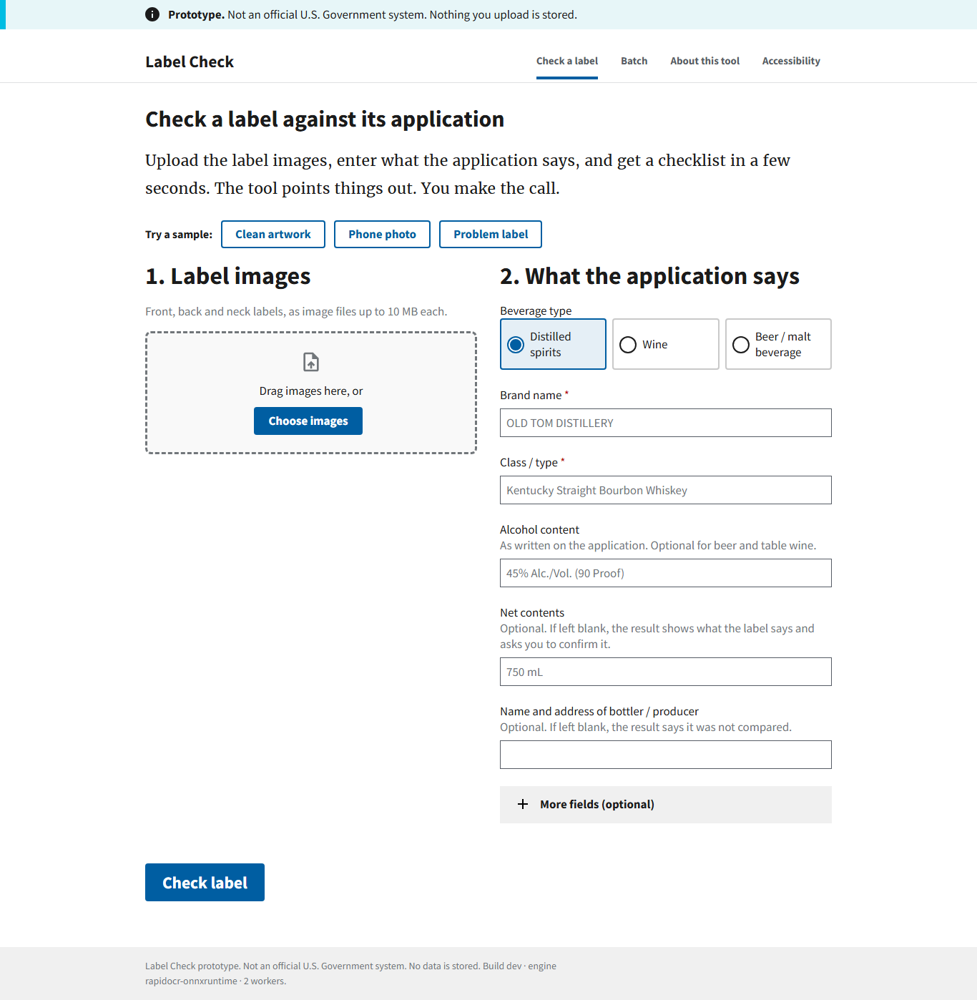
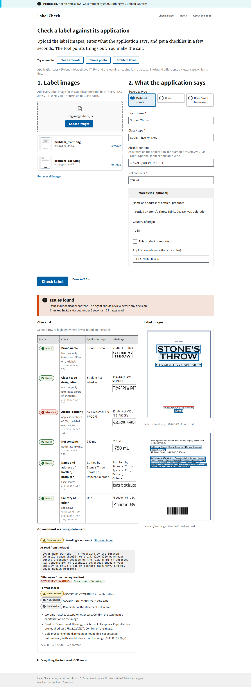
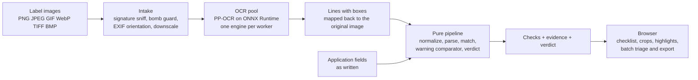

# Label Check

**A prototype that reads alcohol beverage label artwork, compares it with what the COLA application
says, checks the government warning word for word, and shows a compliance agent exactly where on the
label each answer came from. In a few seconds. The tool recommends; the agent decides. Nothing is stored.**

> Prototype for the Treasury take-home exercise. Not an official U.S. Government system.
> Built and documented by Daniel R. Cooley, directing AI coding agents (see [Tools](#tools-and-how-this-was-built)).

- **Live prototype:** https://labelcheck.dev (Azure Container Apps, always on)
- **Approach in two pages:** [docs/APPROACH.md](docs/APPROACH.md)
- **Where each requirement is met:** [docs/REQUIREMENTS_TRACE.md](docs/REQUIREMENTS_TRACE.md)



## Try it in 60 seconds

1. Open the live prototype.
2. Press **Clean artwork**. In about two to three seconds you get a checklist: every field matches,
   the warning is exact, and each row shows the label pixels it was read from.
3. Press **Problem label**. The alcohol content mismatches (45% claimed, 47.5% on the label) and the
   warning heading is in title case. The brand differs only by letter case and is correctly treated
   as a match with a note, which is Dave's "STONE'S THROW" example from the brief. Under the
   result, record your decision (Approve, Reject or Flag, with a note), export it as CSV, or print it.
4. Open **Batch** and press **Load a demo batch**. Five applications and ten images stream in;
   filter to "Needs attention", record a decision, export the CSV.

Then upload your own images. Anything the tool cannot read tells you why and what to do.



## The four things the brief's authors emphasized

The interviews in the brief carry the real requirements, and four phrases are bolded in the original.
Each one is met by design and checked by a test or a measurement, not by a claim.

| Emphasized in the brief | What this prototype does | Evidence |
|---|---|---|
| "If we can't get results back in about **5 seconds**, nobody's going to use it." | OCR runs in-process on a small neural model; the images of one application are read in parallel; every result prints its own timing. | Local: front+back application median 2.5 s, p95 2.9 s on two workers. Deployed (Azure, 2 vCPU), measured by the server's own clock: one person, front+back, median 2.8 s, p95 3.0 s over 20 runs; a front label alone, which triggers the sideways re-read, median 3.6 s, p95 3.9 s; two people submitting at once, p95 4.3 s. Wall time from a laptop adds the network: within 0.1 s of those on a fast connection, 1.5 s more on a congested one (see [Measured](#measured)) |
| "something **my mother could figure out**" | One screen, two numbered steps, one big button, three one-click samples, U.S. Web Design System, statuses as icon + word + color, keyboard and screen-reader friendly, pressed buttons marked in text as well as color so Windows contrast themes show them, and an Accessibility page with the accessibility statement and a Light / Dark / match-my-device display choice kept in the browser only. | Observed usability test: _USABILITY_RESULT_ |
| "**handle batch uploads**" (200 to 300 at once) | Batch screen: a folder of images plus a spreadsheet; rows stream in; filters, decisions, notes, export; pairing by CSV column or filename prefix; leftovers assigned by hand. | 300 images (150 applications) through the real screen with zero errors: 275 s locally, 315 s on the deployed app from a laptop browser: [docs/LOADTEST.md](docs/LOADTEST.md) |
| The warning "has to be **exact**. Like, word-for-word" | Every word and punctuation mark compared with 27 CFR 16.21 (text verified from the eCFR API), ignoring only letter case and spacing next to punctuation. Only an exact match passes. Punctuation and single-character differences are "Needs review" with a diff (usually OCR noise); a changed, added or missing word is a mismatch. | `tests/unit/test_warning.py` golden cases; the "Problem label" sample |

And the constraint behind the architecture: Marcus's network "blocks outbound traffic to a lot of
domains". The verification path makes **no network calls**. Models are in the repository, the page
loads no CDN assets, and a test blocks every socket and runs a full verification
(`tests/integration/test_no_egress.py`). You can run the container with networking disabled.

## How it works



- **Matching has three outcomes.** Match (same after case, accents, quotes, spacing), Needs review
  (close, usually OCR noise, look at the crop), Mismatch or Not found. Heuristic findings are never
  failures; only clear text or numeric differences are: a brand the label does not carry, a number
  that disagrees, an origin statement naming another country, a warning that is missing or worded
  differently. A class/type worded differently from the application's description, a bottler line
  that names another party, or a value the engine could not read are review items with the reason,
  because none of those is a proven defect (decision D-041, reached against 146 real applications).
- **Numbers are compared as numbers.** "45% Alc./Vol. (90 Proof)" in the application and
  "45% ALC/VOL" on the label agree; proof is cross-checked against percent; "12 FL OZ (355 mL)"
  agrees with "355 mL". Net contents may be left blank (the COLA form itself carries none); the
  result then shows what the label says and asks for confirmation instead of a match.
- **The warning check is literal.** The recognizer decodes with an English (printable ASCII) alphabet, so
  there is one transcript, and every word and punctuation mark of it is compared with the regulation's text;
  only letter case and the spacing next to punctuation are ignored. Bold type is measured from the pixels:
  the heading's stroke weight against the rest of its line, a match when clearly heavier, a review item when
  the same, and "not checked" with the reason when the print is too small to measure (D-044). The canonical text, the format rules
  (capitals, bold, contrast, minimum type size) and the container-size lists are documented with their sources in
  [docs/REGULATIONS.md](docs/REGULATIONS.md). Items the tool cannot assess from an image say
  "Not checked" instead of pretending.
- **Batch is orchestrated by the browser.** Each image is read exactly once (the sideways re-read of
  the single-label screen is not run in a batch); each application is compared as soon as its images
  are read; the server keeps no state, refuses rather than queues when it is full (HTTP 429 with
  Retry-After), and gives a waiting person priority over a batch.

## Run it

**With Docker (recommended):**

```bash
docker build -t label-check .
docker run --rm -p 8000:8000 --tmpfs /tmp --network none label-check
# open http://localhost:8000
```

`--network none` is optional and proves the point: the app needs no outside services.

**Without Docker (Python 3.12 or newer):**

```bash
python -m venv .venv
.venv/bin/pip install -r requirements.txt          # Windows: .venv\Scripts\pip
.venv/bin/pip install --no-deps -r requirements-ocr.txt   # rapidocr without its desktop-OpenCV dependency
.venv/bin/uvicorn app.main:app --port 8000
```

For a few seconds after start the verification endpoints return 503 while the models load and the
page shows "starting"; `GET /api/v1/ready` turns 200 when they are warm.

**API (for integration, or for a script):**

```bash
curl -F 'application={"beverage_type":"spirits","brand_name":"OLD TOM DISTILLERY","class_type":"Kentucky Straight Bourbon Whiskey","alcohol_content":"45% Alc./Vol. (90 Proof)","net_contents":"750 mL"}' \
     -F images=@app/static/samples/clean_front.png -F images=@app/static/samples/clean_back.png \
     http://localhost:8000/api/v1/verify
```

Endpoints: `POST /api/v1/verify`, `POST /api/v1/extract`, `POST /api/v1/compare`,
`POST /api/v1/csv/parse`, `GET /api/v1/csv/template`, `GET /api/v1/health`,
`GET /api/v1/openapi.json`. Batch clients send `X-Batch: 1` and honor `Retry-After`.

**Tests and tools:**

```bash
pip install -r requirements-dev.txt
pytest -m "not integration"        # 168 fast unit tests, no OCR
pytest                              # + 18 integration tests through the API with the real engine
python tests/browser/smoke_single.py   # headless browser checks (needs a running server + Playwright)
ruff check . && mypy                # lint and strict typing
python tools/evaluate.py            # accuracy and latency table -> docs/EVAL.md
python tools/loadtest.py --url http://localhost:8000 --mode burst --concurrency 16
python tools/make_labels.py --out tests/fixtures/labels --seed 42 --degraded --problems
```

## Measured

Numbers come from `tools/evaluate.py` and `tools/loadtest.py`; the files they write are committed.

| What | Result | Where |
|---|---|---|
| Field match rate on clean artwork (recall) | 100% on all six fields (60 of 60 checks); warning exact on 10 of 10 | [docs/EVAL.md](docs/EVAL.md) |
| False-alarm rate on clean artwork | 0.0% (0 of 60 field checks) | [docs/EVAL.md](docs/EVAL.md) |
| Degraded images (rotation, blur, glare, low contrast, perspective, small, JPEG, sideways) | fields 95% to 100%; warning exact on 18 of 20; 17 of 20 cases ready, 2 need review, 1 issue (a label shrunk to a third of its size); both sideways photographs ready after the rotation retry, at about 6.8 s | [docs/EVAL.md](docs/EVAL.md) |
| Planted defects detected | 5 of the 5 the tool assesses (wrong ABV, title-case heading, altered wording, missing statement, and the statement set all in bold, caught by measuring stroke weight); the remaining planted defect (tiny type, a physical size) is not assessed and is reported as such | [docs/EVAL.md](docs/EVAL.md) |
| Per-application latency, local (two images, 2 workers) | median 2,536 ms, p95 3,059 ms on clean artwork | [docs/EVAL.md](docs/EVAL.md) |
| Real approved labels: 150 applications from TTB's Public COLA Registry, 50 each spirits, wine, malt, artwork as submitted | Warning statement located on 99% (two misses: one upload set with no statement on it, one label that prints it vertically in type too small to read at the registry's size); wording exact on 62% of those located, small-print slips flagged for review on 22%, wording issues on 16% (including three approved labels that genuinely deviate); the heading measured clearly heavier than the body on 43% and the print was too small to measure on the rest, with no approved label flagged; brand name matched or sent to review on 88%; the registered applicant line (names and address as COLAs stores them) matched the label's bottler line on 70%, the rest sent to review with the reason; country of origin found on 92% of imports; alcohol statement read on 81%, net contents on 80% | [docs/EVAL_REAL.md](docs/EVAL_REAL.md) |
| 146 real applications through the deployed batch screen, with a spreadsheet of the registry's own fields (names and address as registered, class code description, no alcohol or net contents because the COLA form carries neither) | 105 need review, 41 issues (decorative brand type the engine could not read, and warning statements read with wording differences), 0 errors; 0 ready, because a blank net contents always asks for confirmation; the registered bottler line matched the label on 102 of 146. Before D-041 the same run gave 144 issues, nearly all from the bottler line and the class description | [docs/DECISIONS.md](docs/DECISIONS.md) D-040, D-041; [docs/reviews/006-registry-fields.dispositions.md](docs/reviews/006-registry-fields.dispositions.md) |
| Per-application latency, deployed (Azure Container Apps, 2 vCPU, 2 workers, measured from outside) | Server-side, from each response's own timing (the network excluded): one client, front+back, median 2,830 ms, p95 2,955 ms, max 3,400 ms over 20; a front label alone (no statement, so the one extra round of reads runs): median 3,587 ms, p95 3,917 ms over 10; two concurrent clients: median 3,919 ms, p95 4,323 ms, max 5,687 ms; zero refusals. Wall time from this laptop matched those within 0.1 s in the morning (median 2,674 ms one client) and ran about 1.5 s above them on a congested afternoon connection; both runs are in the log | [docs/LOADTEST.md](docs/LOADTEST.md) |
| Batch throughput, deployed (300 images, 150 applications, through the real batch screen from a laptop browser) | 315 s end to end, 0.95 images/s including comparison and rendering, 2.3 s per image median; 150 ready, 0 errors, no browser errors; 100 single-image requests at capacity: 100 of 100 served, server-side p50 1.8 s, p95 1.9 s | [docs/LOADTEST.md](docs/LOADTEST.md) |
| Burst of 16 simultaneous requests | 2 served, 14 refused instantly with 429, health still answering | [docs/LOADTEST.md](docs/LOADTEST.md) |
| 300-image batch through the batch screen (150 applications, local, 2 workers) | 275 s end to end, 1.1 images/s including comparison and rendering; 120 ready, 30 need review, 0 errors, no browser errors | [docs/LOADTEST.md](docs/LOADTEST.md) |
| 300 sequential extract requests at advertised capacity | 300 of 300 served, p95 1.5 s, zero refusals | [docs/LOADTEST.md](docs/LOADTEST.md) |
| Inside the CI container (GitHub runner, 1 worker, networking disabled) | ready 2.1 s after start; front+back application verified in 3.1 s | CI run 33821661824 |

**Error analysis, and one decision worth reading.** The first evaluation showed the multilingual recognizer occasionally emitting an accented letter for a plain one on clean artwork ("alcoholič", "drivé"), which turned an exact warning into "Needs review" on 2 of 10 labels. An early build stripped accents before the comparison; the independent reviewer rejected that, correctly, because a legal "exact" must not paper over instrument error. I then tested a native-resolution re-read of the warning lines, which did not converge (one label fixed, a different accent on another, and a previously exact label lost a letter). The fix that shipped is a recognizer configuration, not a comparison shortcut: the decoder's alphabet is restricted to printable ASCII for every line, the same choice as using an English recognizer and with none of the latency. There is one transcript and it is compared literally. The consequence, stated in the limits: genuinely accented print is read as its base letter, which the field comparisons already tolerate and the evidence crop shows; and the direction that matters legally, an accented character printed inside the warning would be read as its base letter and could pass as exact, is stated there too. The setting is a documented switch (`TTB_OCR_ASCII_ALPHABET`). The remaining degraded misses are a label shrunk to a third of its size (one issue, one review) and one tilted photograph sent to review.

**What 150 real labels changed.** The synthetic corpus has exact ground truth and no surprises, so
on the second day I fetched 150 approved applications from TTB's Public COLA Registry (50 each of
spirits, wine and malt; `tools/cola_fetch.py`, polite and rate-limited) and ran the pipeline on
their label images as submitted (`tools/evaluate_real.py`, [docs/EVAL_REAL.md](docs/EVAL_REAL.md);
the artwork stays local because it belongs to the brand owners). The first pass was humbling: the
warning was never judged exact, because most approved labels print the whole statement in
capitals and the comparator treated letter case as wording; small labels print the statement
vertically along one edge and the upright read never saw it; applicants register "Green Cheek Beer
Company" where the label prints "BREWED BY GREEN CHEEK BEER CO."; and a column filter in the
warning finder silently truncated any statement read from a rotated image, a bug the sideways tier
of the synthetic corpus had been reporting as two "issues" all along. Each of those became a
decision (D-035 to D-038), a code change and a test. The regulation supports the case change:
16.22 requires capitals only for the two anchor words. Hand-checking records against their images
also found the other kind of result: three approved tequila labels that genuinely print "WOMAN" and
"BECAUSE OF RISK OF BIRTH DEFECTS", which the tool reports as a wording issue with the exact words
in the diff. That is the tool working as Jenny asked.

**And what that round cost, caught the next morning.** The sideways re-read shipped as "read every
image again, turned both ways, then at full resolution, whenever no statement was found". Measured
on the deployed build the next morning, that was a mistake in two places: the batch screen reads
each image before it knows its application, so every front label (no statement by design) paid
three extra reads and the 300-image batch went from 364 s to 841 s; and a single front label on the
single-label screen took 8.6 s against a five-second requirement. The reviewer's fifth pass found the
same thing from the code, plus two real defects in the same change: exactness had been made to
ignore spacing by deleting every space, so "womens hould" would have passed, and folding corporate
forms away could pass "LLC" against "Inc.". The build described here is the corrected one
([D-039](docs/DECISIONS.md)): the re-read is one round of parallel reads, at most one per worker,
on the single-label screen only; the batch screen reads every image exactly once; exactness
compares the words and punctuation marks; a corporate-form mismatch is a review item. Every
number in this README was re-measured after that change.

Engine selection and thread scaling are in [docs/BAKEOFF.md](docs/BAKEOFF.md) and
[docs/OCR_EVAL.md](docs/OCR_EVAL.md). Enforced limits and known weaknesses, stated plainly, are in
[docs/LIMITS.md](docs/LIMITS.md).

## For reviewers with a scoring sheet

| Criterion | Where to look |
|---|---|
| Correctness and completeness of core requirements | The three samples; [docs/REQUIREMENTS_TRACE.md](docs/REQUIREMENTS_TRACE.md); `tests/integration/test_verify_api.py` |
| Code quality and organization | `app/pipeline/` (pure functions, unit tested), `app/ocr/pool.py` (admission policy with tests), `app/static/*.js` (no build step, readable in one sitting); ruff + mypy strict in CI |
| Appropriate technical choices for the scope | [docs/APPROACH.md](docs/APPROACH.md), [docs/DECISIONS.md](docs/DECISIONS.md) (including where the first plan was wrong), [docs/OCR_EVAL.md](docs/OCR_EVAL.md) |
| User experience and error handling | Upload a PDF, a 50 MB image, an empty file, or a sideways photo; try the page at 200% zoom, keyboard only, or on a phone |
| Attention to requirements | [docs/REQUIREMENTS_TRACE.md](docs/REQUIREMENTS_TRACE.md), one row per stakeholder statement |
| Creative problem-solving | Evidence crops next to every value; noise-versus-wording classification for the warning; browser-orchestrated batch that keeps the server stateless; measured admission control; the no-egress test; the label generator with exact ground truth |

## Security and data handling

No storage, no logging of label content, no outside calls, signature-based file checks, size and
pixel guards, a strict Content-Security-Policy, a non-root container, per-client and global capacity
limits with honest 429s. No sign-in, deliberately: a fake login proves nothing, and the production
path (Entra ID with PIV in front of the ingress, an audit record with a retention policy) is
described in [docs/SECURITY.md](docs/SECURITY.md).

## Tools, and how this was built

Python 3.12, FastAPI, Pydantic, NumPy, Pillow, RapidFuzz, RapidOCR with PP-OCR models on ONNX
Runtime (vendored, hash-pinned), U.S. Web Design System 3.14 (vendored), pytest, ruff, mypy,
Playwright, Docker, Azure Container Apps. Third-party licenses: [THIRD_PARTY_NOTICES.md](THIRD_PARTY_NOTICES.md).

This was built by directing AI coding agents: Claude Code wrote code under my direction and Codex
served as an independent reviewer. The requirements analysis, the architecture, the review
passes, and every entry in [docs/DECISIONS.md](docs/DECISIONS.md) are mine, including the places
where the agent's first proposal was wrong and how it was caught. The design review and its
point-by-point dispositions are in [docs/reviews/](docs/reviews/). Conventions for the agents are in
[AGENTS.md](AGENTS.md). Commits carry the agent trailer.

## From the author

_AUTHOR_SECTION_

## Configuration

| Variable | Default | Meaning |
|---|---|---|
| `TTB_OCR_WORKERS` | CPU count (max 8) | OCR engines, one per worker thread; also the capacity limit |
| `TTB_OCR_MAX_SIDE` | 1280 | Images are downscaled to this longest side before OCR |
| `TTB_MAX_IMAGE_BYTES` | 10 MB | Per-image cap |
| `TTB_MAX_REQUEST_BYTES` | 40 MB | Per-request cap |
| `TTB_MAX_IMAGE_PIXELS` | 25,000,000 | Decompression-bomb guard |
| `TTB_MAX_IMAGES_PER_APPLICATION` | 6 | Images per verify call |
| `TTB_PER_CLIENT_INFLIGHT` | 4 | Concurrent requests per client |
| `TTB_INTERACTIVE_WAIT_SECONDS` | 8 | How long an interactive request waits for a worker |
| `TTB_WARNING_RESCUE` | true | Single-label screen only: when no usable warning is found upright, one more round of reads in parallel, at most one per worker (the images turned sideways, since small labels print it vertically; large artwork once at full resolution, up to 2048 px). Batch requests read every image exactly once |
| `TTB_MATCH_REVIEW_THRESHOLD` | 80 | Fuzzy score at or above which a non-exact text match is Needs review rather than a mismatch |
| `TTB_TRUST_PROXY` | false | Take the client address from `X-Forwarded-For` (set true behind a platform proxy) |
| `TTB_AGENCY_NAME` | unset | Optional agency name for internal branding (no seals in the public prototype) |
| `GIT_SHA` | dev | Shown in the footer and in `/api/v1/health` |

## Repository layout

```
app/            FastAPI application: routes/, ocr/ (engine + pool), pipeline/ (pure logic), static/ (UI), models/ (vendored OCR models)
tests/          unit/ (fast), integration/ (real engine through the API), fixtures/labels (46 committed images + manifest)
tools/          make_labels.py, evaluate.py, loadtest.py, vendor_models.py, ocr_eval2.py
docs/           APPROACH, REQUIREMENTS_TRACE, LIMITS, SECURITY, REGULATIONS (+ regs/ XML), DECISIONS, EVAL, LOADTEST, OCR_EVAL, BAKEOFF, reviews/
Dockerfile      python:3.12-slim, non-root, health check
```

## License

MIT. See [LICENSE](LICENSE). Sample labels are fictional and generated.
